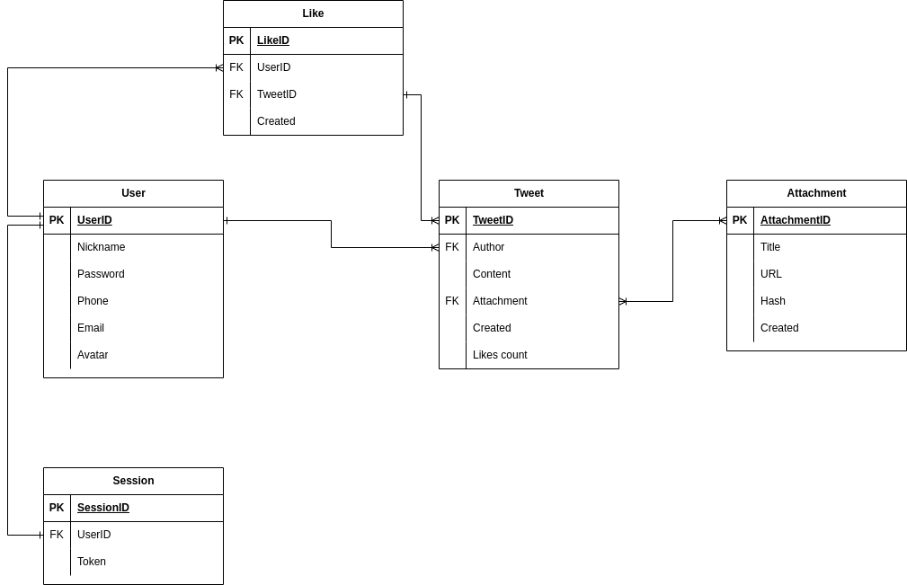
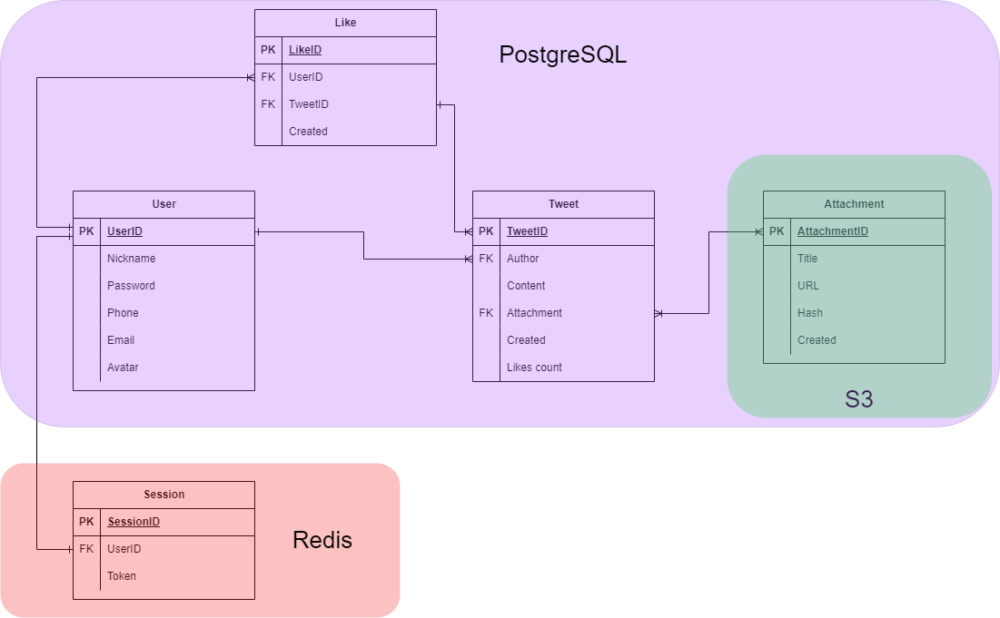
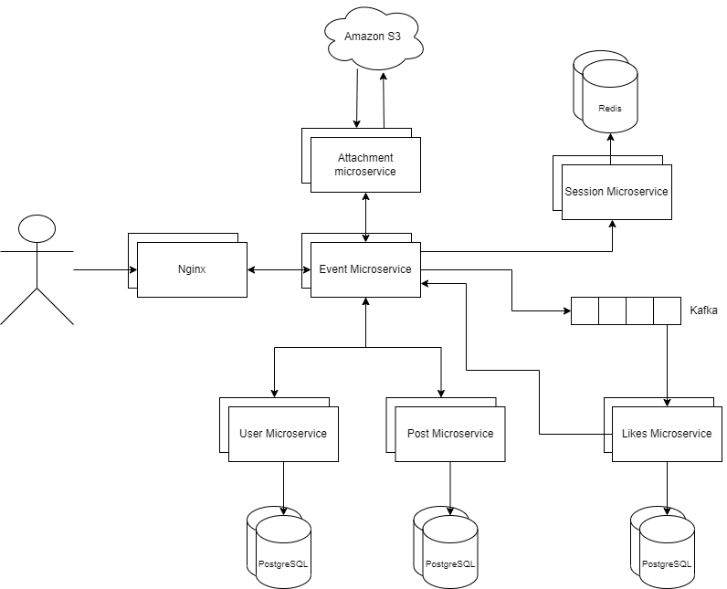

# tp-highload-course-project

## Содержание
- [1. Тема и целевая аудитория](#1)
  - [1.1 Тема](#2)
  - [1.2 Целевая аудитория](#3)
  - [1.3 MVP](#4)
- [2. Расчет нагрузки](#5)
  - [2.1 Продуктовые метрики](#6)
    - [2.1.1 Регистрация и авторизация пользователей](#7)
    - [2.1.2 Публикация твитов](#8)
    - [2.1.3 Проставление лайков](#9)
    - [2.1.4 Просмотр ленты](#10)
    - [Сводная таблица продуктовых метрик](#11)
  - [2.2 Технические метрики](#12)
    - [2.2.1 Размер хранения](#13)
    - [2.2.2 Прирост хранения](#14)
    - [2.2.3 Сетевой трафик](#15)
    - [2.2.4 RPS](#16)
    - [RPS по типам запросов](#17)
- [3. Логическая схема базы данных](#18)
- [4. Физическая схема базы данных](#19)
  - [4.1 Хранение сессий](#20)
  - [4.2 Хранение вложений](#21)
  - [4.3 Хранение постов, лайков, пользователей](#22)
  - [4.4 Индексы](#23)
- [5. Используемые технологии](#24)
- [6. Схема проекта](#25)
- [7. Список серверов](#26)
- [8. Используемые источники](#27)


## <a id="1"></a> 1. Тема и целевая аудитория
### <a id="2"></a> 1.1 Тема
**[Twitter](https://twitter.com/)** &ndash; американский сервис микроблогов и социальная сеть, в которой пользователи публикуют сообщения, известные как «твиты», и взаимодействуют с ними.

### <a id="3"></a> 1.2 Целевая аудитория
Ежемесячная аудитория Twitter на декабрь 2022г составляла 368 млн пользователей. [^3]
Распределение пользователей (топ 10) по миру за январь 2022 года: [^2]
| Страна | Количество пользователей, млн |
|-----------------------------------|-----------|
| США | 76.9 |
| Япония | 58.95 |
| Индия | 23.6 |
| Бразилия | 19.05 |
| Индонезия | 18.45 |
| Великобритания | 18.4 |
| Турция | 16.1 |
| Саудовская Аравия | 14.1 |
| Мексика | 13.9 |
| Тайланд | 11.45 |

### <a id="4"></a> 1.3 MVP
- Регистрация и авторизация пользователей
- Публикация твита
- Проставление лайков
- Просмотр ленты (твитов)

## <a id="5"></a> 2. Расчет нагрузки
### <a id="6"></a> 2.1 Продуктовые метрики
#### Исходные данные:
- Месячная аудитория - 368 млн человек [^3]
- Суточная аудитория - 237.8 млн человек [^1]

#### <a id="7"></a> 2.1.1 Регистрация и авторизация пользователей
По статистике [^3], суммарное количество пользователей твиттера за 2021 год составляло 322,4 млн, а за 2022 год - 329 млн. Значит, за 2022 год приблизительное значение зарегистрировашихся пользователей составит 6,6 млн. Значит, в день будет регистрироваться примерно:  
$$\frac{6.6 млн}{365 дней} \approx 18 тыс/день$$  
В сумме с авторизацацией пусть будет порядка 238 млн в день.

#### <a id="8"></a> 2.1.2 Публикация твитов
В минуту создается или пересылается примерно 456 тысяч твитов [^4]. Предположим, что непосредственно создаваемых твитов 5%. Тогда в среднем создается $$456000 \times 0.05 \times 60 \times 24 \approx 33 млн $$ твитов в день.

#### <a id="9"></a> 2.1.3 Проставление лайков
Пусть в среднем, человек ставит 20 лайков в день, тогда суммарно, в день проставляется $20 \times 237.8 млн = 4.756 млрд$ лайков

#### <a id="10"></a> 2.1.4 Просмотр ленты
Пусть в среднем человек читает порядка 50 твитов в день. При просмотре ленты, за раз прогружается около 30 твитов. Пусть в день человек делает ровно 4 запроса на обновление ленты, тогда суммарно:  
$4 \times 237.8 млн = 951.2 млн$ запросов ежедневно

#### <a id="11"></a> Сводная таблица продуктовых метрик
| Тип запроса | Среднее количество в день|
|-|-|
| Регистрация и авторизация | 238 млн |
| Публикация твита  | 33 млн |
| Проставление лайков | 4.756 млрд |
| Просмотр ленты | 951.2 млн |

### <a id="12"></a> 2.2 Технические метрики
#### <a id="13"></a> 2.2.1 Размер хранения
Размер твитов. Один символ занимает один байт памяти. Предположим, что в среднем твит имеет длину 120 символов. Иногда пользователи прикладывают фотографии к твитам, но т.к. этим пользуются не все, возьмем коэффициент 0.6. Так как максимальный размер вложения 5 МБ, возьмем средний размер 2 МБ, то получим, в среднем каждый твит дополнительно имеет $ 2 \cdot 0.6 = 1.2 МБ $ на вложения. Таким образом, средний размер твита:  
$$1.2 МБ + \frac{120 байт}{1048576} \approx 1.3 МБ$$

По данным статьи [^5], в сумме за период 2012-2022 годов, суммарное количество твитов составляет 6.487 млрд. Тогда размер хранилища под них составляет
$$1.3 МБ \times 6.487 млрд \approx 8 ПБ$$

Помимо твитов, место в хранилище занимает профили пользователей, их контактные данные, аватарка профиля, список твитов.

Пусть на каждого пользователя уходит по 16 КБайт данных. Общее количество пользователей Твиттера - 1,3 млрд

Тогда размер хранилища для пользователей составит: 

$$16 КБ \times 1.3 млрд \approx 19.38 Тб$$

#### <a id="14"></a> 2.2.2 Прирост хранения
По данным статьи [^4], в день сообщество Twitter генерирует порядка 12 ТБ новых данных

#### <a id="15"></a> 2.2.3 Сетевой трафик
Учитывать будем самые тяжелые запросы - публикация твита и обновление ленты.
Из вышеуказанных данных можно посчитать среднюю нагрузку на сеть при публикации твитов:  
$$\frac{1.3 МБ \times 656.64 млн}{60 \times 60 \times 24} \approx 9.65 ГБ/с$$

За день происходит порядка 951.2 млн запросов на просмотр ленты, за один запрос прогружается 30 твитов. Получаем:  
$$\frac{1.3 МБ \times 30 \times 951.2 млн}{60 \times 60 \times 24} \approx 419.3 ГБ/c$$

Итого, в среднем суммарная нагрузка на сеть получается `429 ГБ/c`

#### <a id="16"></a> 2.2.4 RPS
Посчитаем исходя из [сводной таблицы продуктовых метрик](#11)

#### <a id="17"></a> RPS по типам запросов
| Тип запроса | RPS |
|-|-|
| Регистрация и авторизация | 2754 |
| Публикация твита | 7600 |
| Проставление лайков | 55046 |
| Просмотр ленты  | 11009 |

Суммарный RPS составляет 76409 RPS.

## <a id="18"></a> 3. Логическая схема базы данных



Сущности базы данных:

* User - основные сведения о пользователе. Основной ключ - UserID. Содержит в себе никнейм, почту, телефон, ссылку на аватар
* Tweet - твиты пользователей. Основной ключ - TweetID. Содержит в себе ID-шники автора (1:M) и вложений (M:M), содержание и дату публикации
* Like - лайки пользователей. Основной ключ - LikeID. Содержит в себе ID-шники пользователей (1:M) и постов (1:M), а также дату проставления лайка
* Вложение - информация о вложении. Основной ключ - AttachmentID. Содержит в себе название, ссылку на файл в файловом хранилище, дату создания и хеш содержимого для исключения дублей
* Сессия - информация о сессии пользователя. Основной ключ - SessionID. Содержит в себе ID-шник пользователя (1:1) и уникальный сессионный токен

## <a id="19"></a> 4. Физическая схема базы данных



### <a id="20"></a> 4.1 Хранение сессий
Для хранения сессий будем использовать in-memory хранилище Redis. Помимо высокой производительности, Redis умеет в репликацию из коробки.

### <a id="21"></a> 4.2 Хранение вложений
Для хранения вложений будем использовать облачное хранилище Amazon S3. В PostgreSQL будем держать только ссылку на вложение.

### <a id="22"></a> 4.3 Хранение постов, лайков, пользователей
Для всего остального будем использовать PostgreSQL. Для повышения надежности и производительности воспользуемся шардированием.  
Для постов можно применить Range Partitioning, встроенный в PostgreSQL [^6], чтобы быстрее получать доступ к недавним постам. Для этого выделим отдельные высокопроизводительные сервера, на которых будут храниться посты за последнюю неделю, остальные посты распределяются равномерно по оставшимся, менее производительным сервакам.

### <a id="23"></a> 4.4 Индексы
- Nickname - для быстрого поиска пользователя по никнейму
- AttachmentID - для быстрого поиска вложения
- Author - для быстрого поиска поста по автору

## <a id="24"></a> 5. Используемые технологии

| Технология  | Область применения             | Обоснование                                                                                             |
|-------------|--------------------------------|---------------------------------------------------------------------------------------------------------|
| TS + React  | Frontend                       | Универсальный вариант, богатый функционал и хорошая документация   |
| Nginx       | Frontend                       | Высокая производительность, большая функциональность               |                                                  
| Go          | Backend                        | Простота языка, высокая производительность                         |   
| Grafana + Prometeus    | Monitoring          | Мониторинг сервисов                                                |
| Redis       | Backend                        | Высокая производительность                                         |    
| Kafka       | Backend                        | Брокер очередей с партиционированием из коробки                    | 
| Amazon S3   | Backend                        | Высокая производительность, низкая стоимость                       |    
| PostgreSQL  | Backend                        | Высокая производительность и надежность                            |

## <a id="25"></a> 6. Схема проекта


## <a id="26"></a> 7. Список серверов
**Облачное хранилище данных**:

Как было выяснено ранее, для хранении данных пользователей понадобится порядка 20 Тб, а для хранения твитов - 8 Пб.

Основными данными являются медиафайлы, которые предполагается хранить в облачном хранилище Amazon S3. Максимальный размер бакета составляет 5 Тб [^7]. Рассчитаем количество бакетов:

```
8 Пб / 5 Тб = 1,6к, учитывая запас на рост хранилища, хранения логов, метрик и прочего - 5к бакетов
```

| Amazon S3 | Количество бакетов|
|-|-|
| Хранилище данных| 5 000 |


**Брокер сообщений**

В брокере сообщений будут храниться лайки до того, как попадут в микросервис лайков и запишутся в PostgreSQL. Для обеспечения надежности необходимо предусмотреть несколько реплик.

| CPU | RAM (ГБ) | Диск (ГБ) | Количество |
|-|-|-|-|
| 8 | 64 | 2 * 2500 Gb SSD| 3 |

**PostgreSQL**

В среднем, мы можем добиться порядка 4 тысяч RPS на сервер. Так как ранее было указано, что для недавних твитов будут использоваться отдельные, более производительные сервера, то получим приблизительно следующую конфигурацию:


| CPU | RAM (ГБ) | Диск (ТБ) | Количество |
|-|-|-|-|
| 24 | 256 | 5 | 5 |

Для остальных же данных возьмем чуть более простые конфигурации:

| CPU | RAM (ГБ) | Диск (ТБ) | Количество |
|-|-|-|-|
| 12 | 128 | 5 | 20 - на лайки, 10 - на посты, 5 - на пользователей |

**Redis**

Redis является in-memory хранилищем, поэтому требуется большой объем оперативной памяти. Для обеспечения хранения 238 млн сессионных токенов (количество пользователей в день) воспользуемся следующей конфигурацией:

| CPU | RAM (ГБ) | Диск (ГБ) | Количество |
|-|-|-|-|
| 6 | 128 | 50 | 10 |

**Балансировка**

Nginx может выдерживать порядка 50к RPS [^8]. Для обеспечения отказоустойчивости и надежности предусмотрим несколько реплик.

Для того, чтобы выдержать сетевой трафик, воспользуемся 100 Гб сетевыми картами. Учитывая объем сетевого трафика, количество серверов составит:
`627 * 3 (для надежности) / 100 = 19`  
Возьмем 25 серверов, с запасом для обеспечения отказоустойчивости и надежности

| Network | Количество |
|-|-|
| 100 Gb | 25 |
## <a id="27"></a> Используемые источники
[^1]: [Twitter Announces Second Quarter 2022 Results](https://s22.q4cdn.com/826641620/files/doc_financials/2022/q2/Final_Q2'22_Earnings_Release.pdf)
[^2]: [Leading countries based on number of Twitter users as of January 2022](https://www.statista.com/statistics/242606/number-of-active-twitter-users-in-selected-countries)
[^3]: [Number of Twitter users worldwide from 2019 to 2024](https://www.statista.com/statistics/303681/twitter-users-worldwide/)
[^4]: [Handling the Cheapest Fuel- Data](https://www.loginradius.com/blog/engineering/handling-cheapest-fuel-data/)
[^5]: [How Many Tweets per Day 2022 (New Data)](https://www.businessdit.com/number-of-tweets-per-day/)
[^6]: [PostgreSQL: Documentation: 15: 5.11. Table Partitioning](https://www.postgresql.org/docs/current/ddl-partitioning.html#DDL-PARTITIONING-OVERVIEW)
[^7]: [Вопросы и ответы по Amazon S3](https://aws.amazon.com/ru/s3/faqs/#:~:text=S3%20%D0%BC%D0%BE%D0%B6%D0%B5%D1%82%20%D1%81%D0%BE%D1%81%D1%82%D0%B0%D0%B2%D0%BB%D1%8F%D1%82%D1%8C-,%D0%BE%D1%82%200%C2%A0%D0%B1%D0%B0%D0%B9%D1%82%20%D0%B4%D0%BE%205%C2%A0%D0%A2%D0%91,-.%20%D0%A1%D0%B0%D0%BC%D1%8B%D0%B9%20%D0%BA%D1%80%D1%83%D0%BF%D0%BD%D1%8B%D0%B9%20%D0%BE%D0%B1%D1%8A%D0%B5%D0%BA%D1%82)
[^8]: [Optimizations: Tuning Nginx for better RPS of an HTTP API](https://rohitgupta.xyz/blog/tuning-nginx-for-better-rps-of-an-http-api/)
